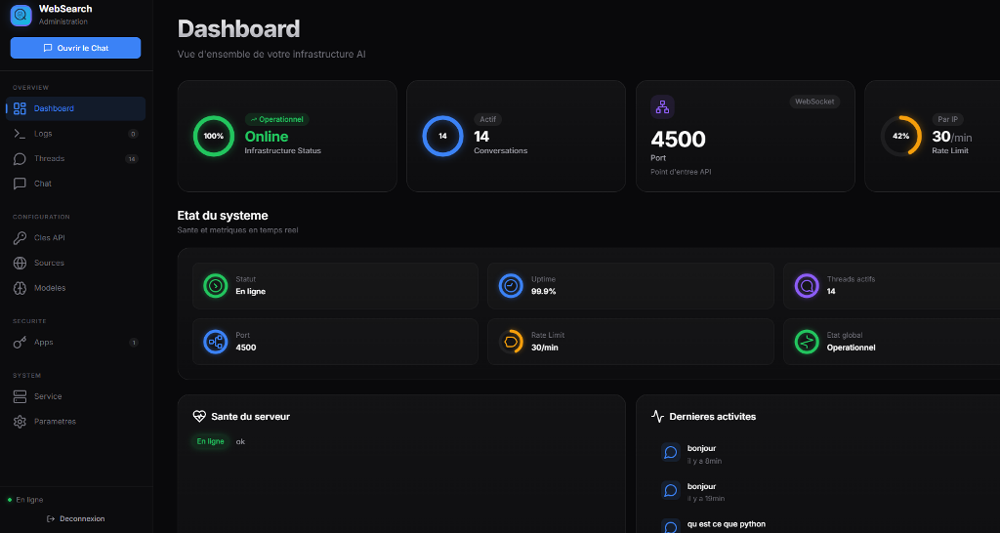
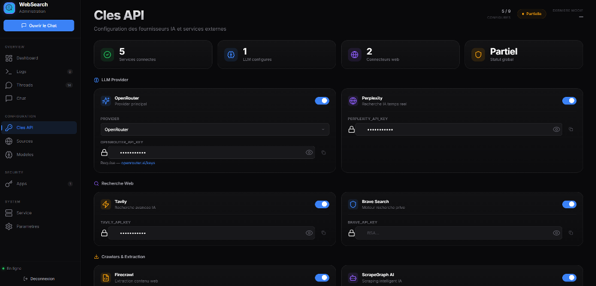

# README — WebSearch Agent

> Voir aussi : [[AGENTS]], [[ARCHITECTURE]], [[OAUTH]], [[INSTALL]]

Agent IA de recherche web ultra-rapide avec function-calling. Selection aleatoire des modeles par requete, routage intelligent, 13 sources de donnees, authentification OAuth2/JWT avec scopes, rate limiting par client, et panneau d'administration complet avec authentification 2FA.

## Screenshots



## Installation

### Installation automatique

```bash
git clone https://github.com/Hajrudin-Zelef/websearch_agent.git
cd websearch_agent
./install.sh
```

Le script installe Docker, configure les cles API, et demarre tous les services.

### Docker

```bash
git clone https://github.com/Hajrudin-Zelef/websearch_agent.git
cd websearch_agent
cp .env.example .env
nano .env
docker compose up -d
```

### Manuel

```bash
git clone https://github.com/Hajrudin-Zelef/websearch_agent.git
cd websearch_agent
python3 -m venv venv
source venv/bin/activate
pip install -r requirements.txt
cp .env.example .env
nano .env
uvicorn server:app --host 127.0.0.1 --port 4500 --loop uvloop --http httptools
```

Guide complet : [[INSTALL]]

## Performance

| Optimisation | Impact |
|---|---|
| uvloop + httptools | Event loop ~2-4x plus rapide |
| GZip middleware | Reponses HTTP compressees (~70% moins de poids) |
| Lazy loading sources | 0 modules charges au demarrage |
| Fast path (1 LLM call) | Outils en parallele + 1 synthese au lieu de 2 appels LLM |
| Content extractor async | aiohttp pour le fetch des pages web |
| Cache LRU | 0ms sur un hit (TTL 5 min, max 200 entrees) |
| Race models | Premier modele qui repond gagne |
| Connection pooling | Clients HTTP reutilises |
| Docker multi-stage | Image optimisee, Python bytecodes pre-compiles |

Temps de reponse :
- Cache hit : **0ms**
- Requete simple : **3-4s**
- Requete complexe : **6-8s**

## Sources de donnees (13)

| Source | Type | Cle API | Description |
|--------|------|---------|-------------|
| Perplexity | Web | Requise | Recherche web intelligente avec citations |
| Tavily | Web | Requise | Recherche web optimisee pour agents IA |
| Brave | Web | Requise | M prive sans tracking |
| DuckDuckGo | Web | Non | M prive sans tracking, sans cle |
| SearXNG | Web | Non | Meta-moteur open-source decentralise |
| Firecrawl | Web | Requise | Recherche avec extraction de contenu complet |
| Just Scrape | Web | Requise | ScrapeGraph AI intelligent |
| Research | Research | Non | Recherche approfondie Wikipedia FR/EN |
| Wikipedia FR | Encyclopedie | Non | Wikipedia francais |
| Wikipedia EN | Encyclopedie | Non | Wikipedia anglais |
| GitHub | Code | Optionnel | Repositories et code open-source |
| News | Actualites | Non | 112 flux RSS (actu, tech, IA, cybersec, sciences) |
| Datasets | Donnees | Non | ~1000 datasets publics (statiques + temps reel) |



## Routeur intelligent

Le routeur detecte automatiquement l'intention, le domaine, et la complexite de la requete pour selectionner les outils les plus pertinents.

### Intentions detectees

search, explain, compare, news, code, data, recommend, howto, definition, history, technical, finance, science

### Domaines

tech, science, history, geography, philosophy, art

### Niveaux de complexite

| Niveau | Score | Outils | Exemple |
|--------|-------|--------|---------|
| 1 - Simple | 0-39 | 3 | "python", "bonjour" |
| 2 - Moyen | 40-64 | 7 | "comparaison React vs Vue.js" |
| 3 - Complexe | 65-100 | 13 | "quel est le meilleur framework AI en 2026 et pourquoi" |

## Pool de modeles

Selection aleatoire ponderee par requete. Si un modele echoue, le suivant est essaye automatiquement.

| Modele | Poids | Timeout |
|--------|-------|---------|
| llama-4-maverick | 4 | 6s |
| qwen-2.5-7b | 3 | 6s |
| qwen3-8b | 2 | 8s |
| deepseek-chat-v3 | 1 | 6s |
| mistral-small-3.1 | 1 | 6s |

## Authentification

L'API supporte 3 modes d'authentification :

### 1. API Key (simple)

```bash
curl -H "X-API-Key: ws_..." http://localhost:4500/chat -d '{"message":"test"}'
```

### 2. OAuth2 (recommande)

```bash
# Obtenir un token
curl -X POST http://localhost:4500/oauth/token \
  -H "Content-Type: application/json" \
  -d '{"client_id":"...","client_secret":"..."}'

# Utiliser le token
curl -H "Authorization: Bearer eyJ..." http://localhost:4500/chat -d '{"message":"test"}'
```

### 3. Sans credentials (backward compatible)

```bash
curl http://localhost:4500/chat -d '{"message":"test"}'
# Rate limit par IP (30 req/min)
```

Guide complet : [OAUTH.md](OAUTH.md)

## Scopes & Permissions

Les clients OAuth2 ont des scopes qui definissent leurs permissions :

| Scope | Description | Endpoints |
|-------|-------------|-----------|
| `read` | Lire et rechercher | `/search`, `/threads`, `/datasets` |
| `write` | Envoyer des messages | `/chat` |
| `admin` | Gerer l'administration | `/admin/*` |

Scopes par defaut : `["read", "write"]`

## Rate Limiting

| Type | Limite | Configurable |
|------|--------|--------------|
| Par client (API key/JWT) | 30 req/min (defaut) | Oui via admin |
| Par IP (sans credentials) | 30 req/min | Non |

## API Endpoints

| Method | Endpoint | Description | Auth |
|--------|----------|-------------|------|
| POST | `/chat` | Recherche conversationnelle | write |
| GET | `/search` | Recherche structuree | read |
| POST | `/oauth/token` | Obtenir un access token | client_id/secret |
| POST | `/oauth/token/refresh` | Rafraichir un token | refresh_token |
| GET | `/threads` | Liste les threads | - |
| GET | `/threads/{id}` | Detail d'un thread | - |
| DELETE | `/threads/{id}` | Supprimer un thread | - |
| GET | `/threads/{id}/context` | Contexte pour follow-up | - |
| GET | `/datasets` | Datasets | - |
| GET | `/health` | Health check | - |
| GET | `/metrics` | Metriques agent | - |

### Reponse `/chat`

```json
{
  "response": "Le W3C est un organisme... [1] [2]",
  "refused": false,
  "thread_id": "5595c0fb-8ffe-41f7-a1d1-0eb4fc19f37a"
}
```

### Citations

Les reponses incluent des citations numerotees `[1]`, `[2]` correspondant aux sources extraites des pages web. Le systeme :
1. Execute les outils de recherche en parallele
2. Fetch les URLs trouvees et extrait le contenu lisible (trafilatura)
3. Passe les extraits numerotes au LLM pour synthese avec citations
4. Ne cite jamais une page qui n'a pas ete fetchee

### Exemples

```bash
# Recherche simple
curl -X POST /chat -H "Content-Type: application/json" -d '{"message": "qu\'est-ce que le W3C ?"}'

# Follow-up
curl -X POST /chat -H "Content-Type: application/json" -d '{"message": "et ses standards ?", "thread_id": "..."}'

# Datasets
curl "/datasets?query=climat&max_results=5"

# Avec API key
curl -H "X-API-Key: ws_..." /chat -d '{"message":"test"}'

# Avec OAuth2
curl -H "Authorization: Bearer eyJ..." /chat -d '{"message":"test"}'
```

Guide d'integration API complet : [API.md](API.md) (JavaScript, Python, PHP, Go, Rust, Flutter, Swift, Kotlin, C#, n8n, Make, Zapier)

## Panneau d'administration

Acces : `/admin`

- Authentification avec 2FA (TOTP)
- Gestion des cles API et client_secret pour les apps connectees
- Configuration des scopes et rate limit par client
- Activation/desactivation des sources de donnees
- Configuration du pool de modeles et des timeouts
- Logs en temps reel avec filtres
- Settings runtime (system prompt, cache, rate limiting)
- Dashboard metriques temps reel avec SVG
- Circuit breaker par source
- Webhooks automatiques
- Export CSV des logs
- Restart/stop du service

## Flux RSS (112)

- **Francophone** — Le Monde, France24, Mediapart, France Info, Nouvel Obs, HuffPost...
- **International** — BBC, CNN, Guardian, Al Jazeera, NPR, Fox News...
- **Tech** — TechCrunch, The Verge, Wired, Ars Technica, ZDNet, Hacker News...
- **IA** — OpenAI, DeepMind, Google AI, Hugging Face, arXiv (cs.AI, cs.LG, cs.CL, cs.CV)...
- **Cybersecurite** — Krebs, Schneier, BleepingComputer, Dark Reading, Unit42...
- **Programmation** — Coding Horror, Overreacted, InfoQ, Martin Fowler, Stack Overflow...
- **Langages** — Python, Rust, Go, Node.js, Deno, React, Vue, TypeScript, Swift, Kotlin...
- **Newsletters** — JavaScript Weekly, Rust Weekly, Golang Weekly, ByteByteGo...
- **Frontend** — Smashing, CSS-Tricks, Astro, Svelte, Next.js, Tailwind...
- **Engineering blogs** — Netflix, Meta, Spotify, AWS, Cloudflare, GitHub, Vercel, Stripe...
- **Sciences** — Nature, NASA, Space.com, Phys.org, Scientific American...

## Variables d'environnement

### Obligatoires

| Variable | Description |
|----------|-------------|
| `PROVIDER` | Fournisseur LLM (`openrouter`) |
| `OPENROUTER_API_KEY` | Cle API OpenRouter |

### Optionnelles

| Variable | Description |
|----------|-------------|
| `PERPLEXITY_API_KEY` | Cle API Perplexity |
| `TAVILY_API_KEY` | Cle API Tavily |
| `BRAVE_API_KEY` | Cle API Brave Search |
| `SEARXNG_URL` | URL instance SearXNG |
| `GITHUB_TOKEN` | Token GitHub (optionnel, 5000 req/h) |
| `FIRECRAWL_API_KEY` | Cle API Firecrawl |
| `SGAI_API_KEY` | Cle API ScrapeGraph AI |
| `JWT_SECRET` | Secret pour les tokens JWT (defaut: genere aleatoirement) |
| `ADMIN_USER` | Identifiant admin |
| `ADMIN_PASSWORD` | Mot de passe admin |
| `ADMIN_TOTP_SECRET` | Secret TOTP pour 2FA |

## Architecture

```
websearch_agent/
├── sources/
│   ├── __init__.py             # Lazy loading + registry unifie
│   ├── router.py               # Routeur intelligent (intent/domain/complexity)
│   ├── content_extractor.py    # Extraction async (aiohttp + trafilatura)
│   ├── perplexity.py           # API Perplexity (sonar)
│   ├── tavily.py               # API Tavily
│   ├── brave.py                # API Brave Search
│   ├── duckduckgo.py           # DuckDuckGo (sans API)
│   ├── searxng.py              # SearXNG (meta-moteur)
│   ├── firecrawl_search.py     # Firecrawl (contenu complet)
│   ├── just_scrape.py          # ScrapeGraph AI
│   ├── research.py             # Recherche Wikipedia FR/EN
│   ├── wikipedia.py            # Wikipedia francais
│   ├── wikipedia_en.py         # Wikipedia anglais
│   ├── github.py               # GitHub API
│   ├── news_rss.py             # 112 flux RSS (cache TTL 10 min)
│   └── datasets.py             # ~1000 datasets publics
├── routes/
│   ├── api.py                  # /chat, /search, /datasets, /health, /threads
│   ├── admin.py                # /admin/* (settings, plugins, clients, logs, env)
│   ├── auth.py                 # Login, logout, sessions, 2FA
│   ├── oauth.py                # OAuth2 token endpoint + JWT + scopes
│   └── rate_limit.py           # Rate limiting (sliding window, par client)
├── core/
│   ├── settings.py             # Cache settings (TTL 30s)
│   ├── prompts.py              # System prompts + modules metier
│   ├── monitoring.py           # Metriques agent_stats
│   ├── cache.py                # Cache LLM (LRU, TTL)
│   ├── circuit_breaker.py      # Circuit breaker pour les sources
│   ├── events.py               # Webhook dispatch asynchrone
│   ├── models.py               # Pool de modeles LLM
│   └── tools.py                # Definition des outils
├── agent.py                    # Agent function-calling (fast path + fallback)
├── server.py                   # FastAPI (admin, auth 2FA, rate limiting, GZip)
├── threads.py                  # Persistance SQLite (threads de conversation)
├── clients.py                  # Gestion clients API (cles, secrets, scopes, rate limit)
├── admin/                      # Panneau d'administration web
│   ├── index.html              # Dashboard HTML
│   └── js/                     # Modules JS (chat, clients, settings, etc.)
├── Dockerfile                  # Multi-stage build
├── docker-compose.yml          # Docker + SearXNG
├── requirements.txt
├── .env.example
└── docs/
    ├── README.md               # Cette documentation
    ├── INSTALL.md              # Guide d'installation complet
    ├── API.md                  # Guide d'integration API
    ├── OAUTH.md                # Guide OAuth2 et authentication
    └── TROUBLESHOOT.md         # Guide de depannage
```

## Securite

- Authentification admin avec 2FA (TOTP)
- Authentification API : API Key, OAuth2 JWT, ou backward compatible (IP)
- Scopes JWT (read, write, admin) pour controler l'acces par endpoint
- Rate limiting configurables par client (defaut: 30 req/min)
- Rate limiting par IP pour les clients non authentifies
- Tokens JWT avec expiration (1h) et refresh (15 min grace period)
- Validation Pydantic des entrees
- Body size limit (10 KB max)
- Headers de securite (X-Content-Type-Options, X-Frame-Options, Referrer-Policy)
- CORS whitelist explicite
- Cache-Control no-cache sur les pages HTML
- Variables d'environnement pour les secrets
- `.env` dans `.gitignore`
- Docker non-root (appuser UID 1000)
- Client secrets hashés (SHA-256) en base de données

Guide de securite : [TROUBLESHOOT.md](TROUBLESHOOT.md)

## Commandes utiles

```bash
# Sante
curl /health

# Recherche
curl -X POST /chat -H "Content-Type: application/json" -d '{"message":"bonjour"}'

# OAuth2 - Obtenir un token
curl -X POST /oauth/token -H "Content-Type: application/json" \
  -d '{"client_id":"...","client_secret":"..."}'

# OAuth2 - Rafraichir un token
curl -X POST /oauth/token/refresh -H "Content-Type: application/json" \
  -d '{"refresh_token":"eyJ..."}'

# Systemd
systemctl --user status websearch-agent
systemctl --user restart websearch-agent
journalctl --user -u websearch-agent -f

# Docker
docker compose up -d
docker compose logs -f
docker compose down
```

## Support

- GitHub : https://github.com/Hajrudin-Zelef/websearch_agent
- Issues : https://github.com/Hajrudin-Zelef/websearch_agent/issues
